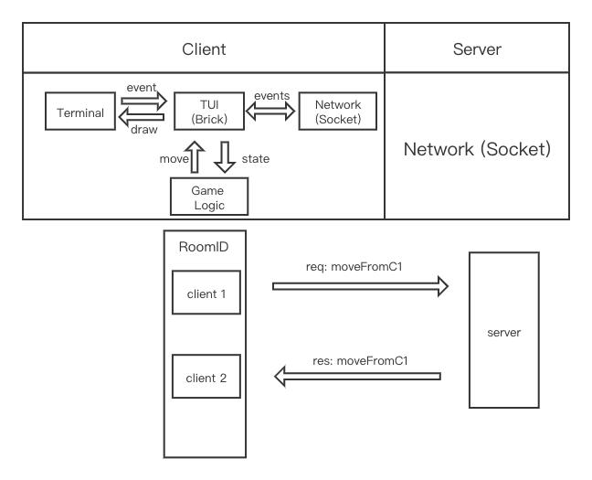

# huarong-haskell
Final Project for CSE 230 Fall 2021

Huarong Dao, a Chinese klotski puzzle

An implementation of the Chinese Klotski game in Haskell using the brick library.

The Chinese wooden game Huarong Dao, based on the ancient history from the Three Kingdom period, is a special Klotski puzzle that is popular in China. Like other sliding-block puzzles, several different sized wooden blocks are placed inside a box. Each brick can only move vertically or horizontally according to the available space left. The goal of the game is to use the minimal steps to move Cao Cao (the largest square one) to a special area designated by the game board (usually on the bottom). There are multiple settings of the game, and we will demonstrate this game using the classic setting called “Cha Chi Nan Fei” (Hard to escape) as shown in the picture.  

This application will render the game in command line. The player has 4 options towards each given brick, up “w”, down “s”, right “d”, and left “a”.During each round, the player would first select one brick then perform the movement.  Each movement can move the brick 1 unit on the board. If the brick cannot be moved anymore, none of those options would be executed if selected and will not be accounted for the total steps used. The optimal steps will be given on the top right corner as reference. 

The application will have an option to play with another player through networking. The two players will compete side by side and the player who solves the puzzle with fewer steps or lower time wins the game. The opponent’s board state will be shown on the side of the screen. 

## Nov. 29th Update:

For the logic part of our project. we defined the basic game structure and game logic. We defined the game board as a 2D array with the size of 5 * 4. Since our Characters have different sizes, we use different amounts of tiles to represent certain characters. For example, we use only one tile to represent Zu, and we use 2*2 tiles to represent Caocao -- the largest character in our game. And our game has will have the status “step” to record the current step the player used, and “status” to check whether the player has already won the game or not. As we described in our proposal, when Caocao escaped the board, the player will win the game. 

The next step for our logic part is to finish the move function. Since our games’ characters have different sizes, we are going to consider the different functions for the different characters. We also need to check whether the movement is valid or not before we actually make that move. The current challenge is I didn’t come up with an optimal solution that can efficiently perform the movement. For now, my initial solution is just iteratively to move every single tile of the character one by one. I am going to do more research and try to find out if there are more optimal ways to solve this problem. 


The Brick App will be the core of the system. It displays a TUI to the terminal and accepts input from the terminal. The Brick App utilizes the Game Logic as the state for drawing the TUI and tells Game Logic what actions to perform on the game board. The Brick App communicates with the networking side of the app through events and messages.

The current challenge for the TUI is the implementation of a cursor. The cursor is a highlighter used to select a piece during an action. Since the size of the pieces is variable, there may be multiple pieces that can move in the same direction. Therefore, we will need a cursor to highlight which piece we will be moving. The cursor affects multiple parts of the TUI, including the state, the appearance of the tiles, and the events. We want to find a way to nicely present the cursor so that it is intuitive to the player while implementing it in a not overly complicated way. 

The networking part is a simple client-server structure with socket connections. The server matches the clients together to play a game and sends the moves directly from one client to the other so that the client can display the two players’ boards side by side. If we have time, we can add board verification to ensure the boards are synchronized. 

We expect to be able to finish a simple multiplayer game of Huarongdao by the deadline. 

App architecture Diagram:


<!-- [] (images/architecture.png) -->


## Build & Install

```bash
$ stack build
$ stack install
```

## Client

### start

Run 
`$ /path/to/huarong-haskell-exe `

## Server

### start

Run 
`$ /path/to/huarong-haskell-server-exe `

### API

#### createRoom

- create a game room
- return the uuid of the game room

```json
// - request sample
// - from client A
{
  "reqService": "createRoom",
  "reqPayload": ""
}
```

```json
// - response sample
// - to client A
{
  "resService": "createRoom",
  "resPayload": "{\"status\":true,\"detail\":\"6905c091-3d5d-4334-9824-0c0b8637a1b6\"}"
}
```

#### leaveRoom

- leave a game room by uuid
- broadcast a player leaving infomation in the game room

```json
// - request sample
// - from client A
{
  "reqService": "leaveRoom",
  "reqPayload": ""
}
```

```json
// - response sample
// - to client A and to client B
{
  "resService": "Info",
  "resPayload": "{\"status\":true,\"detail\":\"Leave 6905c091-3d5d-4334-9824-0c0b8637a1b6\"}" //json
}
```

#### joinRoom

- join a game room marked by uuid
- leave the current game room by default
- broadcast a player joining infomation in the game room

```json
// - request sample
// - from client A
{
  "reqService": "joinRoom",
  "reqPayload": "6905c091-3d5d-4334-9824-0c0b8637a1b6"
}
```

```json
// - response sample
// - (currently in a game room)
// - to client A and to client C
{
  "resService": "Info",
  "resPayload": "{\"status\":true,\"detail\":\"Leave c302c282-111e-4205-aba6-c5b747449a0c\"}" //json
}
```

```json
// - response sample
// - to client A and to client B
{
  "resService": "Info",
  "resPayload": "{\"status\":true,\"detail\":\"Join 6905c091-3d5d-4334-9824-0c0b8637a1b6\"}" // json
}
```

#### move

- broadcast the moves in the game room

```json
// - request sample
// - from client A
{
  "reqService": "move",
  "reqPayload": "MoveEvent (Move {_x = 2, _y = 3, _direction = Down}) 0"
}
```

```json
// - response sample
// - to client A and to client B
{
  "resService": "move",
  "resPayload": "MoveEvent (Move {_x = 2, _y = 3, _direction = Down}) 0"
}
```

### Schematic diagram of API call

```plain

client A - createRoom -> (waiting Join Info) - move -> (waiting move Info)
      |                     ^                                   ^
      |                     |                                   |
  room uuid               server                              server
      |                     |                                   |
      |                     |                                   |
      V                     V                                   V
client B - joinRoom -> (waiting Join Info)  - move ->  (waiting move Info)
```


Reference and image source:

[Wikipedia page for Klotski](https://en.wikipedia.org/wiki/Klotski)

Contributors: Dun Ma, Jiewen Yang, Mohan Li, Jinyi Mu
